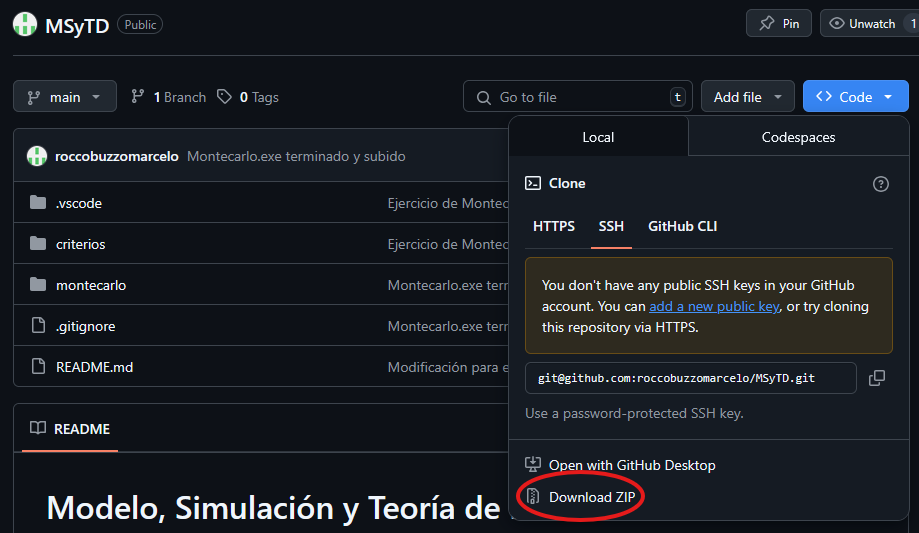

# Modelo, Simulación y Teoría de la Desición

- **Alumno:** Buzzo Marcelo, Rocco
- **Legajo:** 190292

## 🔧 Necesario: Descargar e instalar Java

- Accedé al siguiente enlace oficial de Oracle para descargar Java: 👉 <https://www.oracle.com/java/technologies/downloads/#java21>
- Descargá el instalador para tu sistema operativo.
- Ejecutá el instalador y seguí los pasos de instalación.
- Una vez finalizado, volvé a probar el comando java -version para confirmar que se instaló correctamente.

## Ejecutar la aplicación

Una vez instalado Java, podés ejecutar la aplicación de la siguiente forma:

- Primero descargamos el repositorio:

- Una vez descargado el repositorio lo extraemos, y luego entramos a la carpeta `montecarlo` y luego ejecutar el `montecarlo.exe`.
